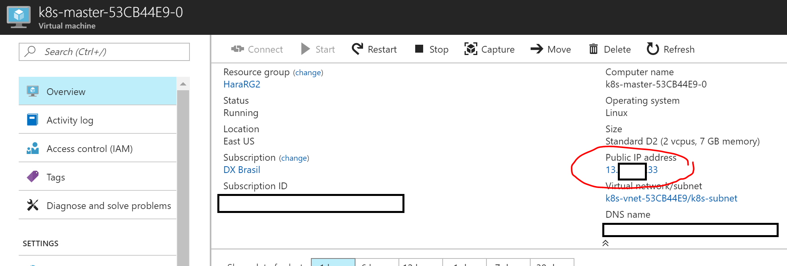

# Move Kubernetes management from one machine to another

These steps will cover how to move kubectl management from one machine to another. All the procedures here are based on Kubernetes on Azure Container Services but could be used for any environment. 

## Scenario

I had created the K8s cluster (on Azure Container Services) using an Windows 10 machine (command line, not bash) and now I want to move to Bash for Windows 10. 

## Requirements

1. You must have Kubectl installed on destination computer

## Steps

1. Copy **ID_RSA** and **ID_RSA.PUB** to the destination computer

- On Windows this files are located on **c:\Users\Your_Username\.ssh** folder

Copy these files to .ssh folder on Linux (assuming that you will use Linux. Otherwise you can create the folder **.ssh** on user Profile folder and copy these files on another Windows machine)

2. Locate the public IP Address for Master machine. You can access the Azure Portal / Resource Group / K8s Master virtual machine / Public Ip Address




3. To verify if the proper SSH files are working connect via SSH on destination computer using **azureuser** as username. This is the default user created during ACS process. Use the IP Address obtained from previous step. 

```bash
ssh azureuser@1.1.1.1
```

You will notice that the password is not required and the connection will be completed. If not please review the previous steps.


4. Copy  **config** from Kubernetes Master (located on ACS) to your destination computer using the following command:

```bash
scp azureuser@1.1.1.1:.kube/config $HOME/.kube/config
```

- Note: replace the IP Address (this is just an example)

5. Now you can test the connection using some commands:

```kubectl
kubectl cluster-info
```

```kubectl
kubectl get pod
```

```kubectl
kubectl get node
```

